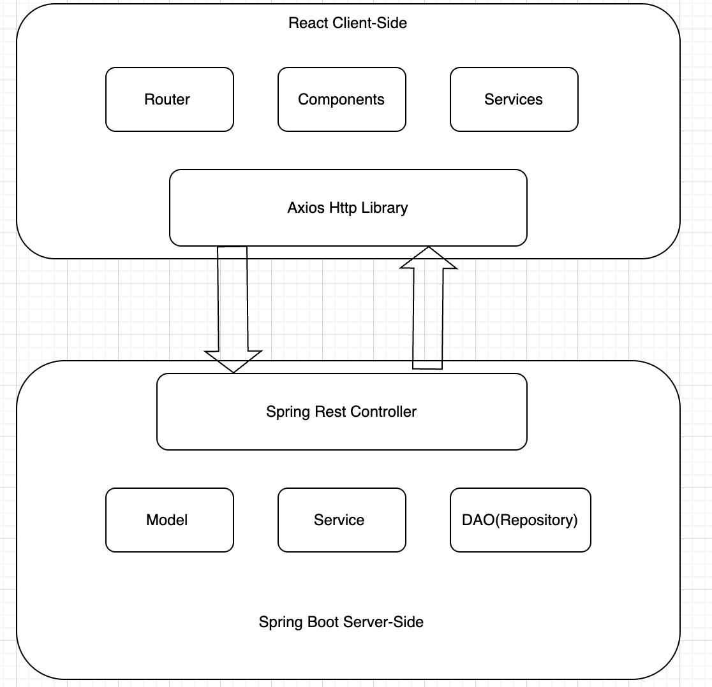

# Trading-Platform- Design Documentation

***Introduction:***

This trading platform is a web-based solution allowing users to research, analyze and trade stocks
along with other financial instruments. Key features of such platform emphasized are security, real-time
stock data, user-friendly interface and **algorithmic trading functionalities

The main purpose of such application is to provide better security, user-friendly interface and zero
downtime, as well as potentially building own customizable algorithmic trading system.

***

***System Architecture***:

I picked RESTFUL API architecture instead of the traditional Spring MVC architecture because I want to
have a seperation of concerns: server-side, client-side, such that React and Springboot are used for
the client and server respectively. 

***Overall Architecture***

***Server-Side Design***

**Entity(model)**

Contains data entities/ domain objects: Account, Order and Stock.These entity
classes are mapped to postgreSQL database using Hibernate.

**DAO (Repository)**

Referred as Data Access Objects, the DAO package contains data access interfaces and implementation, providing
methods for performing CRUD operations (Create,Read, Update, Delete) on entity objects. The DAO interfaces
defines the contract for interacting with the database, while the concrete DAO implementation handles database-specific
logic. 

**Service Layer**

The service package contains service classes that encapsulates the business logic of the application, orchestrating
interactions between the repositories and REST controllers.

**Rest Controller**

The rest package contains three Rest controllers, which are AccountRestController, OrderRestController, and
StockRestController. These controllers handles the incoming http requests and map them to the corresponding
service layer methods. They also handle any request validation, error handling, and response formatting 

